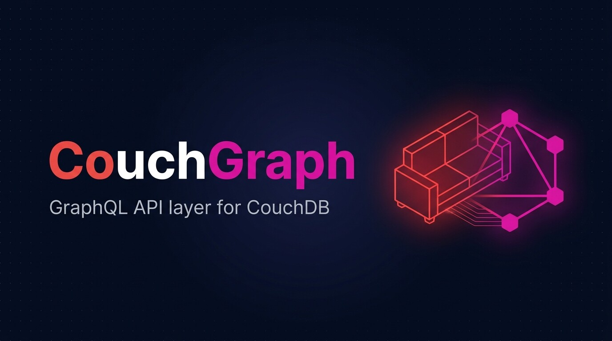
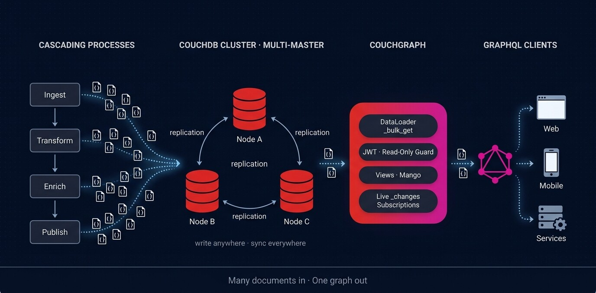

<p align="center">
  
</p>

# CouchGraph

[](https://github.com/devton/couchgraph/actions/workflows/ci.yml)

> High-performance, schema-first GraphQL API layer for CouchDB, written in Go.

CouchGraph exposes CouchDB through a modern GraphQL API — eliminating REST boilerplate and N+1 query bottlenecks. Query documents by UUIDv7 ID, run [Mango](https://docs.couchdb.org/en/stable/api/database/find.html) selectors, execute MapReduce views with built-in reduce aggregations (`_count`, `_stats`, `_sum`), and cross documents with nested 1:1 and 1:N relational modeling.

You don't need to know Go to use it. The [`couchgraph` CLI](#standalone-cli-a-typed-api-without-writing-go) turns a GraphQL schema annotated with directives into a running API.

---

## How It Works

<p align="center">
  
</p>

1. **Cascading processes** (ingest → transform → enrich → publish) each write JSON documents straight into CouchDB. There's no shared queue to coordinate and no schema migrations to run.
2. **A multi-master CouchDB cluster** accepts writes on any node and replicates them to the others. Writes keep flowing even while a node is down, and conflicts are tracked by revision instead of locks.
3. **CouchGraph** sits in front of the cluster. It batches lookups through `_bulk_get` (DataLoader), enforces JWT and read-only guards, exposes Views and Mango queries, and streams `_changes` as live subscriptions.
4. **GraphQL clients** (web, mobile, other services) query one typed graph instead of going through dozens of REST endpoints.

> **Many documents in · One graph out.**

---

## Key Features

- **Schema-first GraphQL** — powered by [gqlgen](https://gqlgen.com/) with full introspection and GraphiQL Explorer.
- **Generic & Agnostic Core** — full schemaless support for any CouchDB database (`scalar Map`, `findDocs`, `queryView`).
- **Domain Modeling & Relations** — define strongly-typed GraphQL entities (`Movie`, `Director`, etc.) with nested 1:1 and 1:N relations.
- **Zero N+1 Query Engine** — internal `couch.Loader` batches lookups into single CouchDB `_bulk_get` requests.
- **MapReduce Views & Aggregations** — exact single key (`key`), multi-key lookup (`keys`), ranges (`startKey`/`endKey`), and grouped reduce aggregations (`group: true`).
- **Mango Queries** — pass declarative `_find` selectors, projections, and sort descriptors.
- **Cursor Pagination** — native CouchDB bookmark pagination without `OFFSET` performance traps.
- **Full CRUD & Bulk Writes** — single `upsertDoc`/`deleteDoc` and atomic `bulkDocs` (`_bulk_docs`).
- **UUIDv7 Primary Keys** — time-ordered, sortable document identifiers generated automatically (`uuid.NewV7()`).
- **Docker & Dokploy Ready** — ultra-lightweight distroless container image (< 15 MB).

---

## Documentation & Guides

- [Getting Started Guide](./docs/getting-started.md) — Local setup, environment config, and quickstart.
- [GraphQL API Reference](./docs/graphql-api.md) — Detailed reference for all queries, mutations, subscriptions, security guards, and metrics.
- [Relations & Domain Modeling Guide](./docs/relations-and-domain-modeling.md) — 1:1, 1:N relations, virtual collections, and foreign keys.
- [JWT Auth & User-Scoped Documents](./docs/auth-and-user-scoped-documents.md) — Multi-tenancy, user ownership, and Row-Level Security (RLS).
- [Architecture Deep Dive](./docs/architecture.md) — DataLoader batching, UUIDv7 indexing, and layer design.
- [Dokploy Deployment Guide](./docs/deployment-dokploy.md) — Production deployment with Traefik and auto SSL.
- [RFC-001: Dynamic Schema Engine](./docs/rfc-001-dynamic-schema-engine.md) — Standalone, config-driven mode: SDL directives, JS resolvers, CLI, and Go library API.
- [Agent Role System Runbook](./docs/runbooks/agent-role-system.md) — Operational execution playbook for autonomous agent workflows.
- [Plan to Blueprint Runbook](./docs/runbooks/plan-to-blueprint.md) — Transformation guide from plan to executable blueprints.
- [Movies CLI Example](./examples/movies/) — A complete `couchgraph.yaml` project: SDL + directives + design docs, no Go.
- [IMDb Dataset & Query Examples](./examples/movies_queries.graphql) — 12 ready-to-use GraphQL queries.

---

## Quick Start

### 1. Start CouchDB locally

```bash
docker-compose up -d couchdb
```

### 2. Configure environment

Copy the environment file and configure your CouchDB credentials:

```bash
cp .env.example .env
```

```ini
COUCHDB_URL=http://localhost:5984
COUCHDB_USER=admin
COUCHDB_PASSWORD=password
COUCHDB_DATABASE=couchgraph
PORT=8080
PLAYGROUND_ENABLED=true
```

### 3. Run the server

```bash
go run ./cmd/server
```

Open [http://localhost:8080](http://localhost:8080) for the interactive **GraphQL Playground** with the GraphiQL Explorer and Docs Explorer.

---

## Testing with the IMDb Dataset Seeder

CouchGraph includes an on-demand dataset seeder (`cmd/seed/main.go`) that populates classic movies, directors, foreign key relations, Mango indexes, and MapReduce views:

```bash
# Seed the default test database (couchgraph_movies); connection settings come from .env:
go run ./cmd/seed

# Or pick another database:
go run ./cmd/seed -db my_movies_db
```

The seeder does not hard-code any views. It pushes the design documents declared by [`examples/movies/couchgraph.yaml`](./examples/movies/couchgraph.yaml) (`-project` flag), the same files `couchgraph sync` uses, so seeding and serving never rewrite each other's view indexes. Each run deletes and recreates the movie/director documents, so their UUIDv7 IDs change.

Once seeded, open [http://localhost:8080](http://localhost:8080) and run queries from [`examples/movies_queries.graphql`](./examples/movies_queries.graphql).

---

## Standalone CLI: a Typed API Without Writing Go

The `couchgraph` CLI serves a typed GraphQL API straight from a project folder. You write the GraphQL schema, annotate it with directives that say where each field comes from in CouchDB, and provide your design documents. There is no Go code and no code generation step.

```text
examples/movies/
├── couchgraph.yaml               # connection, schema paths, design docs, server options
├── schema/movies.graphqls        # SDL + directives (@collection, @get, @find, @view, ...)
└── couchdb/design/movies.json    # MapReduce views, pushed to CouchDB on start
```

### 1. Install

```bash
# Prebuilt binaries (linux/darwin/windows, amd64/arm64) are attached to each GitHub Release.
# Or build from source:
go install github.com/devton/couchgraph/cmd/couchgraph@latest
```

### 2. Describe the API in SDL

[`examples/movies/schema/movies.graphqls`](./examples/movies/schema/movies.graphqls) (excerpt):

```graphql
type Movie @collection(type: "movie") {
  id: ID!                       # read from _id
  title: String!
  runtimeMinutes: Int!          # read from runtime_minutes (snake_case fallback)
  boxOffice: Int @field(from: "box_office_usd")
  director: Director @belongsTo(field: "director_id")   # batched _bulk_get
}

type Director @collection(type: "director") {
  id: ID!
  name: String!
  movies: [Movie!]! @hasMany(view: "movies/by_director_id")
}

type GenreCount {
  genre: String! @field(from: "key")
  movies: Int!   @field(from: "value")
}

extend type Query {
  movie(id: ID!): Movie @get
  movies(genre: String, minRating: Float, limit: Int = 20): [Movie!]!
    @find(selector: "{\"genres\": {\"$elemMatch\": {\"$eq\": \"$genre\"}}, \"rating\": {\"$gte\": \"$minRating\"}}")
  directors: [Director!]! @view(name: "movies/all_directors")
  genreCounts: [GenreCount!]! @view(name: "movies/by_genre", reduce: true, group: true)
}
```

| Directive | What it does |
|---|---|
| `@collection(type:)` | Maps a type to documents with `type == "..."`. `@find` adds that filter automatically, and `@get` returns `null` when the document belongs to another collection |
| `@field(from:)` | Reads a field from a different key, including dot paths (`value.sum`) |
| `@get` | Fetches one document by `id` through a batched `_bulk_get` |
| `@find(selector:, sort:, limit:)` | Runs a Mango `_find` query. `"$arg"` placeholders are filled from field arguments, and a filter is dropped when its argument is omitted |
| `@view(name:, key:, reduce:, group:, includeDocs:)` | Queries a MapReduce view. Reduce rows come back as `{key, value}` |
| `@belongsTo(field:)` | 1:1 relation. Lookups from every item in a list are batched into a single `_bulk_get` |
| `@hasMany(view:, key:)` | 1:N relation through a view keyed by the parent `_id` |

### 3. Validate, then serve

```bash
cd examples/movies
export COUCHDB_URL=http://localhost:5984 COUCHDB_USER=admin COUCHDB_PASSWORD=password

couchgraph validate
# ok: 14 types, 65 fields, 17 directive bindings, 1 design docs

couchgraph serve          # pushes couchdb/design/*.json, then serves on :8080
couchgraph sync           # push design docs only (idempotent: "unchanged" when up to date)
```

`couchgraph.yaml` values can reference the environment, for example `url: ${COUCHDB_URL:-http://localhost:5984}`. A `.env` file in the working directory is loaded as well. Run `couchgraph init my-api` to scaffold a new project.

### 4. Query

```graphql
{
  movies(minRating: 8.8, limit: 3) {
    title
    rating
    runtimeMinutes
    boxOffice
    director { name birthYear }
  }
  genreCounts { genre movies }
}
```

```json
{
  "data": {
    "movies": [
      { "title": "The Shawshank Redemption", "rating": 9.3, "runtimeMinutes": 142, "boxOffice": 73300000,
        "director": { "name": "Frank Darabont", "birthYear": 1959 } },
      { "title": "The Godfather", "rating": 9.2, "runtimeMinutes": 175, "boxOffice": 291000000,
        "director": { "name": "Francis Ford Coppola", "birthYear": 1939 } },
      { "title": "The Dark Knight", "rating": 9, "runtimeMinutes": 152, "boxOffice": 1006000000,
        "director": { "name": "Christopher Nolan", "birthYear": 1970 } }
    ],
    "genreCounts": [ { "genre": "Action", "movies": 3 }, { "genre": "Crime", "movies": 4 }, "..." ]
  }
}
```

With `schema.core: true`, the generic API (`document`, `findDocs`, `queryView`, mutations, `docChanges`) is served next to your typed schema. The example sets `readOnly: true`, so mutations are rejected. The design is described in [RFC-001](./docs/rfc-001-dynamic-schema-engine.md).

---

## Usage Modes

### Mode 1: Standalone Schemaless Service (Agnostic)

Use CouchGraph out-of-the-box as a high-performance GraphQL bridge for any CouchDB database without writing Go code:

#### Mango Query (`_find`)
```graphql
query FindSciFiMovies {
  findDocs(input: {
    selector: {
      type: "movie"
      genres: { "$in": ["Sci-Fi"] }
      rating: { "$gte": 8.5 }
    }
    sort: [{ rating: "desc" }]
    limit: 5
  }) {
    docs {
      _id
      data
    }
  }
}
```

#### MapReduce View with Grouped Aggregation
```graphql
query MovieCountPerGenre {
  queryView(input: {
    designDoc: "movies"
    viewName: "by_genre"
    reduce: true
    group: true
  }) {
    totalRows
    rows {
      key
      value
    }
  }
}
```

---

### Mode 2: Custom Domain Modeling & Schema Extensions

> Prefer not to write Go? The [standalone CLI](#standalone-cli-a-typed-api-without-writing-go) covers the same relations with SDL directives. This mode is for Go teams that want compile-time types and custom resolver logic on the gqlgen-generated schema.

You can easily extend CouchGraph with strongly-typed domain schemas, business queries, and nested document relations.

#### Step 1: Define your domain schema (`internal/graph/schema/ecommerce.graphqls`)
```graphql
type Product {
  id: ID!
  title: String!
  price: Float!
  categoryId: ID!
  
  # 1:1 relation resolved via DataLoader (_bulk_get):
  category: Category
}

type Category {
  id: ID!
  name: String!
  
  # 1:N relation resolved via MapReduce View:
  products: [Product!]!
}

extend type Query {
  product(id: ID!): Product
  products(limit: Int): [Product!]!
  categories: [Category!]!
}
```

#### Step 2: Configure relation resolvers in `gqlgen.yml`
```yaml
models:
  Product:
    fields:
      category:
        resolver: true
  Category:
    fields:
      products:
        resolver: true
```

#### Step 3: Generate and implement resolvers
```bash
gqlgen generate
```

In `internal/graph/resolver/ecommerce.resolvers.go`:
```go
// 1:1 Lookups use DataLoader (Zero N+1):
func (r *productResolver) Category(ctx context.Context, obj *model.Product) (*model.Category, error) {
    loader := couch.NewLoader(r.Repo)
    doc, err := loader.LoadAndWait(ctx, obj.CategoryID)
    if err != nil || doc == nil {
        return nil, err
    }
    return mapToCategory(doc), nil
}

// 1:N Lookups query the indexed foreign key view:
func (r *categoryResolver) Products(ctx context.Context, obj *model.Category) ([]*model.Product, error) {
    falseVal := false
    res, err := r.Repo.QueryView(ctx, couch.ViewOptions{
        DesignDoc: "catalog",
        ViewName:  "by_category_id",
        Key:       obj.ID,
        Reduce:    &falseVal,
    })
    // map rows to []*model.Product...
}
```

For full details and patterns, read the [Relations & Domain Modeling Guide](./docs/relations-and-domain-modeling.md).

---

## Configuration Reference

All settings can be configured via environment variables (e.g. in `.env` or Docker) or a `config.yaml` file:

| Variable | Default | Description |
|---|---|---|
| `COUCHDB_URL` / `COUCHGRAPH_COUCHDB_URL` | `http://localhost:5984` | CouchDB endpoint URL |
| `COUCHDB_USER` / `COUCHGRAPH_COUCHDB_USER` | `admin` | CouchDB BasicAuth username |
| `COUCHDB_PASSWORD` / `COUCHGRAPH_COUCHDB_PASSWORD` | `password` | CouchDB BasicAuth password |
| `COUCHDB_DATABASE` / `COUCHGRAPH_COUCHDB_DATABASE` | `couchgraph` | Default CouchDB database |
| `PORT` / `COUCHGRAPH_SERVER_PORT` | `8080` | Server HTTP port |
| `READ_ONLY` / `MUTATIONS_ENABLED` | `false` | Disable all GraphQL mutations globally |
| `AUTH_ENABLED` / `COUCHGRAPH_AUTH_ENABLED` | `false` | Enable JWT Bearer token authentication |
| `JWT_SECRET` / `COUCHGRAPH_AUTH_JWT_SECRET` | `""` | HMAC-SHA256 secret for token verification |
| `REQUIRE_AUTH` / `COUCHGRAPH_AUTH_REQUIRE_AUTH` | `false` | Require JWT for read queries as well |
| `METRICS_ENABLED` / `COUCHGRAPH_METRICS_ENABLED` | `true` | Expose Prometheus metrics endpoint |
| `METRICS_PATH` / `COUCHGRAPH_METRICS_PATH` | `/metrics` | HTTP path for Prometheus metrics |
| `PLAYGROUND_ENABLED` / `COUCHGRAPH_SERVER_PLAYGROUND_ENABLED` | `true` | Enable GraphiQL Playground (`/`) |
| `LOG_LEVEL` / `COUCHGRAPH_LOG_LEVEL` | `info` | Logging level (`debug`, `info`, `warn`, `error`) |
| `LOG_FORMAT` / `COUCHGRAPH_LOG_FORMAT` | `console` | Log format (`console` or `json`) |

---

## Architecture

```
GraphQL Client (Browser / Mobile / Microservice)
        │
        ▼  POST /query
┌─────────────────────────────────────────┐
│   gqlgen Server + GraphiQL Explorer     │  :8080/
└────────────────────┬────────────────────┘
                     │
        ┌────────────┴────────────┐
        ▼                         ▼
┌──────────────────┐    ┌──────────────────┐
│ Schemaless Core  │    │ Typed Extensions │
│ (findDocs, Views)│    │ (Movie, Director)│
└────────┬─────────┘    └────────┬─────────┘
         │                       │
         ▼                       ▼
┌──────────────────────────────────────────┐
│   couch.Repository + couch.Loader        │  DataLoader (_bulk_get batching)
└────────────────────┬─────────────────────┘
                     │ BasicAuth HTTP
                     ▼
┌──────────────────────────────────────────┐
│   CouchDB Cluster (:5984)                │
│   _find, _bulk_get, _design/_view        │
└──────────────────────────────────────────┘
```

---

## Project Layout

```
couchgraph/
├── cmd/
│   ├── couchgraph/main.go              # Standalone CLI (init, serve, validate, sync)
│   ├── server/main.go                  # Env-driven server entry point (ENGINE=gqlgen|dynamic)
│   └── seed/main.go                    # IMDb movies & directors seeder
├── internal/
│   ├── config/config.go                # Environment & YAML config loader
│   ├── project/project.go              # couchgraph.yaml loader (schema, design docs, ${ENV})
│   ├── server/server.go                # HTTP wiring shared by CLI and server
│   ├── engine/                         # Dynamic schema engine (runtime ExecutableSchema)
│   │   ├── execute.go                  # Executor (null propagation, lists, introspection)
│   │   ├── directives.graphqls         # @collection, @field, @get, @find, @view, @belongsTo, @hasMany
│   │   ├── directives.go               # Directive → resolver compiler
│   │   └── core.go                     # Generic core API resolvers
│   ├── couch/
│   │   ├── client.go                   # Kivik CouchDB client wrapper
│   │   ├── repository.go               # CouchDB CRUD, Views, and Mango operations
│   │   ├── store.go                    # Store interface (Repository + test fakes)
│   │   ├── batch.go                    # Per-operation batching loader (_bulk_get)
│   │   └── dataloader.go               # Request-level _bulk_get batcher
│   └── graph/                          # gqlgen-generated engine (Go extension path)
│       ├── schema/                     # Core SDL (also embedded by the dynamic engine)
│       ├── resolver/                   # Go resolvers
│       ├── model/models_gen.go         # Generated Go GraphQL models
│       └── scalar/map.go               # Custom Map JSON scalar
├── examples/
│   ├── movies/                         # CLI project: couchgraph.yaml + schema/ + couchdb/design/
│   └── movies_queries.graphql          # Query examples for the generic API
├── .github/workflows/ci.yml            # Tests + cross-platform builds + releases
├── docs/                               # Guides & Architecture runbooks
├── docker-compose.yml
├── Dockerfile
└── gqlgen.yml
```

---

## Testing & Code Quality

```bash
# Run all unit tests (race detector, as in CI)
go test -race ./...

# Run static analysis / vetting
go vet ./...

# Compile entire project
go build ./...

# Compare the dynamic engine with the gqlgen-generated one
go test ./internal/engine -run Parity -v
go test ./internal/engine -bench Engines -benchmem -run '^$'
```

Every push and pull request runs [CI](./.github/workflows/ci.yml): `go mod tidy` and `gofmt` checks, build, vet, race tests, `couchgraph validate` on the example projects, and cross-compiled binaries for linux/darwin/windows (amd64/arm64). Pushing a `v*` tag publishes them as a GitHub Release.

---

## Roadmap

- [x] Strongly-typed domain schema extensions (1:1 & 1:N relations)
- [x] DataLoader batching via `_bulk_get` (Zero N+1)
- [x] MapReduce Reduce aggregations (`_count`, `_stats`, `_sum`, `group`)
- [x] Global Read-Only Mode (`READ_ONLY=true` / `MUTATIONS_ENABLED=false`)
- [x] Per-request JWT Authentication & Role-based Mutation Control
- [x] Real-time GraphQL Subscriptions via CouchDB `_changes` feed (WebSockets)
- [x] Prometheus metrics endpoint (`/metrics`)
- [ ] Full-Text Search Integration (CouchDB Nouveau / Lucene `_nouveau` & Mango `$text` operator)
- [ ] Multi-database support: optional `COUCHDB_DATABASE` (default only), per-request database via `db` argument on generic operations, `COUCHDB_ALLOWED_DATABASES` allowlist with system databases (`_*`) always blocked, and DataLoader keyed by `db + id`
- [x] Standalone config-driven mode: dynamic schema engine + SDL directives (`@collection`, `@field`, `@get`, `@find`, `@view`, `@belongsTo`, `@hasMany`) via `couchgraph.yaml` ([RFC-001](./docs/rfc-001-dynamic-schema-engine.md))
- [x] CLI: `couchgraph init`, `serve`, `validate`, `sync` (design docs)
- [x] CI: tests (race) + cross-platform binaries (linux/darwin/windows, amd64/arm64), GitHub Releases on `v*` tags
- [ ] CLI: `serve --watch` (hot reload) and Mango index sync
- [ ] Distribution: Homebrew tap and Docker image `ghcr.io/devton/couchgraph`
- [ ] Custom resolvers without Go (embedded JS runtime) for logic beyond directives
- [ ] Public Go library API (`pkg/couchgraph`) for native resolvers on the same engine
- [ ] OpenTelemetry tracing

---

## License

MIT
