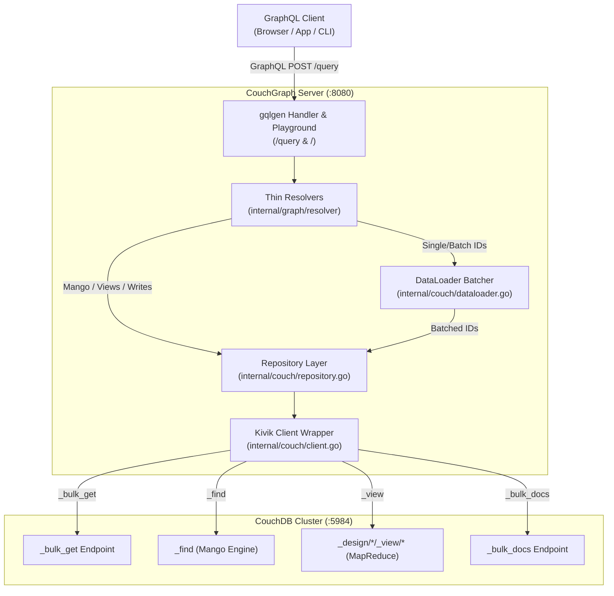

# CouchGraph Architecture

> Deep dive into CouchGraph internals, layer separation, performance patterns, and design decisions.

---

## 1. System Overview

CouchGraph serves as a high-performance, type-safe GraphQL bridge positioned directly between GraphQL clients and CouchDB 3.x instances.



---

## 2. Core Architectural Pillars

### Pillar 1: Schema-First GraphQL with `gqlgen`
- **Schema Source of Truth**: Defined in `internal/graph/schema/schema.graphqls`.
- **Strict Code Generation**: `gqlgen` generates type-safe Go bindings into `internal/graph/generated/` and `internal/graph/model/`.
- **Custom Scalar Support**: The `Map` scalar cleanly marshals Go `any` into valid JSON GraphQL responses.

### Pillar 2: UUIDv7 Primary Keys
CouchDB's native UUID generation yields arbitrary hexadecimal strings that do not preserve time ordering.
CouchGraph overrides ID creation to use **UUIDv7** (`uuid.NewV7()`):

- **48-bit UNIX Timestamp Prefix**: Guarantees lexicographical sorting by creation time.
- **Efficient B-Tree Indexing**: Minimizes CouchDB B-Tree rebalancing on insertions.
- **Range Queries by Time**: Enables natural `startKey` / `endKey` temporal filtering on ID views without secondary indexing.

### Pillar 3: DataLoader Batching (`_bulk_get`)
In standard GraphQL architectures, nested lookups create the classic **N+1 query problem**. 
CouchGraph embeds a per-request `couch.Loader`:

```
Resolvers: doc(id: 1), doc(id: 2), doc(id: 3)
   │
   ▼
[Loader Queue] (deduplicates & aggregates IDs)
   │
   ▼ 1 single HTTP request
POST /{db}/_bulk_get {"docs":[{"id":"1"},{"id":"2"},{"id":"3"}]}
   │
   ▼
Fan-out results back to individual resolver channels
```

### Pillar 4: Thin Resolvers & Clean Architecture
Resolvers only unpack arguments, invoke the repository, and map results. All CouchDB interaction logic resides in `internal/couch/`:

| Package | Responsibility |
|---|---|
| `internal/config` | Loads environment variables and YAML settings via Viper. |
| `internal/couch` | Manages Kivik driver connections, CRUD, Mango queries, views, and DataLoader batching. |
| `internal/graph/schema` | GraphQL SDL definitions. |
| `internal/graph/resolver` | Transport-level GraphQL resolvers. |
| `internal/graph/scalar` | Custom Map scalar unmarshaler and marshaler. |
| `cmd/server` | Application lifecycle, graceful shutdown, and HTTP routing. |

---

## 3. Performance & Production Recommendations

1. **Mango Indexes**:
   Always create CouchDB indexes (`_index`) for fields used in `findDocs` selectors. Without an index, CouchDB performs a full database scan.
2. **Connection Pooling**:
   The Kivik client wrapper shares HTTP connections via Go's `http.Transport` with keep-alive enabled.
3. **Graceful Shutdown**:
   Listens for `SIGINT`/`SIGTERM` to finish in-flight requests cleanly within a 10-second grace period.
