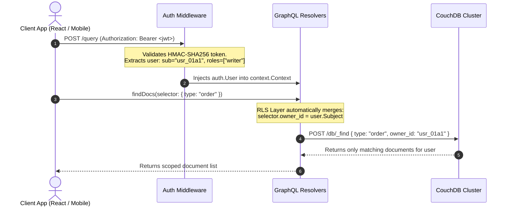
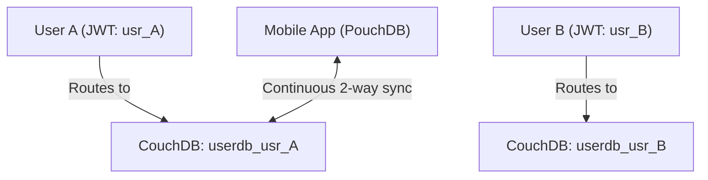

# JWT Authentication & User-Scoped Documents in CouchGraph

> Architecture guide, patterns, and recipes for multi-tenancy, user ownership, and Row-Level Security (RLS) in CouchGraph.

---

## 1. Overview

When building multi-tenant SaaS, collaborative tools, or user-facing applications with CouchGraph, you need to ensure that **User A can only access and modify documents that belong to User A**, while administrators maintain elevated access.

CouchGraph handles authentication and document scoping through:
1. **Per-request JWT Bearer Token validation** (`internal/auth`).
2. **Context-propagated user identity** (`auth.User` with `sub`, `roles`, and `scopes`).
3. **Automated Row-Level Security (RLS)** in GraphQL operations and CouchDB queries.



---

## 2. JWT Configuration & Token Structure

### Configuration in `.env`
```ini
# Enable JWT verification
AUTH_ENABLED=true

# HMAC-SHA256 secret key
JWT_SECRET=your-256-bit-secret-key-here

# Require JWT for read queries as well (if false, unauthenticated can read public queries)
REQUIRE_AUTH=false
```

### Standard JWT Payload Format
```json
{
  "sub": "usr_01a107be-6492-7538-8ed8-8262766ca648",
  "email": "alice@example.com",
  "roles": ["writer"],
  "scopes": ["read", "write"],
  "iat": 1759651200,
  "exp": 1759737600
}
```

---

## 3. The 3 Architectural Scoping Patterns

### Pattern 1: Automatic Field-Level Ownership & RLS *(Most Popular for SaaS)*

Every user-owned document stores an `owner_id` (or `user_id` / `tenant_id`):

```json
{
  "_id": "01a10a7c-a780-7693-b5f2-82e66a29a905",
  "type": "document",
  "owner_id": "usr_01a107be-6492-7538-8ed8-8262766ca648",
  "title": "Confidential Report",
  "content": "..."
}
```

#### 1. Mango Queries (`findDocs` / Domain queries)
The resolver automatically enforces the user's scope:

```go
func (r *queryResolver) MyDocuments(ctx context.Context) ([]*model.Document, error) {
    user := auth.ForContext(ctx)
    if user == nil {
        return nil, errors.New("unauthorized")
    }

    selector := map[string]any{
        "type": "document",
    }
    
    // Non-admin users are strictly scoped to their own documents
    if !user.IsAdmin() {
        selector["owner_id"] = user.Subject
    }

    res, err := r.Repo.Find(ctx, couch.FindOptions{Selector: selector})
    // ...
}
```

#### 2. Fetch by ID (`document(id)` / `movie(id)`)
Prevents ID guessing or direct object reference vulnerabilities:

```go
func (r *queryResolver) ScopedDocument(ctx context.Context, id string) (*model.Document, error) {
    user := auth.ForContext(ctx)
    doc, err := r.Repo.GetDoc(ctx, id)
    if err != nil || doc == nil {
        return nil, err
    }

    // Verify ownership
    if !user.IsAdmin() && doc["owner_id"] != user.Subject {
        return nil, errors.New("document not found or access denied")
    }

    return rawToDocument(doc), nil
}
```

#### 3. Mutations (`upsertDoc` / `deleteDoc`)
- **Creation**: CouchGraph automatically stamps `doc["owner_id"] = user.Subject`. The client cannot forge or assign a different owner.
- **Updates & Deletions**: CouchGraph verifies that the existing document before the update belongs to `user.Subject`.

---

### Pattern 2: Compound Keys in MapReduce Views *(High-Performance Indexing)*

For complex MapReduce views and aggregations, CouchDB supports **Array compound keys** where the first element is the `owner_id`:

#### Design Document Map Function (`_design/analytics`):
```javascript
function (doc) {
  if (doc.type === "transaction" && doc.owner_id && doc.created_at) {
    // Compound Key: [owner_id, created_at]
    emit([doc.owner_id, doc.created_at], doc.amount);
  }
}
```

#### Scoped GraphQL Query:
When querying the view, CouchGraph locks the key range to the user's partition:

```graphql
query UserTransactions {
  queryView(input: {
    designDoc: "analytics"
    viewName: "by_owner_date"
    startKey: ["usr_01a107be6492"]
    endKey: ["usr_01a107be6492", {}] # {} in CouchDB collation matches the highest possible value
    reduce: false
  }) {
    rows {
      key
      value
    }
  }
}
```

**Result:** CouchDB scans only the user's slice in the B-tree index. Zero data leakage across users.

---

### Pattern 3: Database-per-User *(Offline-First / PouchDB Sync)*

For mobile apps, local-first architectures, or privacy-critical applications, CouchDB allows creating an isolated database per user (e.g. `userdb_usr_01a1`):



- **Dynamic Routing**: In CouchGraph, a custom client resolver picks the database name dynamically based on `user.Subject`.
- **Physical Isolation**: Complete separation at the storage level with native peer-to-peer sync.

---

## 4. Native CouchDB Document Validation (`validate_doc_update`)

In addition to CouchGraph's GraphQL layer enforcement, you can add native JavaScript validation functions in CouchDB design documents to enforce rules at the database engine level:

```javascript
// Inside _design/auth:
{
  "validate_doc_update": `function(newDoc, oldDoc, userCtx, secObj) {
    // Reject updates if user is not the owner
    if (oldDoc && oldDoc.owner_id) {
      if (oldDoc.owner_id !== userCtx.name && userCtx.roles.indexOf('_admin') === -1) {
        throw({ forbidden: 'You may only modify your own documents.' });
      }
    }
  }`
}
```

---

## 5. Security Checklist for Multi-Tenant Deployments

1. **Always enable `AUTH_ENABLED=true`** in production.
2. **Use strong JWT secrets** (minimum 256-bit random entropy).
3. **Index `owner_id`** in Mango indexes (e.g. `{"fields": ["owner_id", "type", "created_at"]}`).
4. **Use UUIDv7 IDs** for primary keys to ensure time-ordered sorting within user partitions.
5. **Set `READ_ONLY=true`** on read replicas or public demonstration endpoints.
