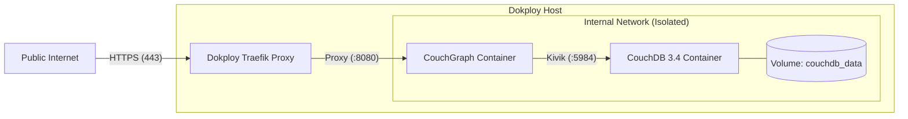

# Deploying CouchGraph to Dokploy

> Complete guide for deploying CouchGraph and CouchDB on Dokploy with automatic HTTPS, persistent volumes, and Traefik routing.

---

## 1. What is Dokploy?

[Dokploy](https://dokploy.com/) is an open-source, self-hosted Platform-as-a-Service (PaaS) alternative to Heroku and Coolify. It provides automated SSL/TLS via Let's Encrypt, Traefik reverse proxying, and Docker Compose stack management.

---

## 2. Architecture on Dokploy



---

## 3. Step-by-Step Deployment

### Step 1: Create a Compose Project in Dokploy

1. Log into your **Dokploy Dashboard**.
2. Navigate to your **Project** and click **Create Service**.
3. Select **Compose**.
4. Name your service (e.g. `couchgraph-prod`).

---

### Step 2: Configure the Compose File

In the **Compose** tab, paste the contents of [`docker-compose.dokploy.yml`](file:///Users/ton/work/couchgraph/docker-compose.dokploy.yml):

```yaml
version: "3.9"

services:
  couchdb:
    image: couchdb:3.4
    container_name: couchgraph-couchdb
    restart: unless-stopped
    environment:
      COUCHDB_USER: ${COUCHDB_USER:-admin}
      COUCHDB_PASSWORD: ${COUCHDB_PASSWORD:-changeme_secure_password}
    volumes:
      - couchdb_data:/opt/couchdb/data
    networks:
      - couchgraph-internal
    healthcheck:
      test: ["CMD", "curl", "-sf", "http://localhost:5984/_up"]
      interval: 10s
      timeout: 5s
      retries: 5
      start_period: 10s

  couchgraph:
    build:
      context: .
      dockerfile: Dockerfile
    container_name: couchgraph-server
    restart: unless-stopped
    environment:
      COUCHGRAPH_COUCHDB_URL: http://couchdb:5984
      COUCHGRAPH_COUCHDB_USER: ${COUCHDB_USER:-admin}
      COUCHGRAPH_COUCHDB_PASSWORD: ${COUCHDB_PASSWORD:-changeme_secure_password}
      COUCHGRAPH_COUCHDB_DATABASE: ${COUCHGRAPH_DATABASE:-couchgraph}
      COUCHGRAPH_SERVER_PORT: 8080
      COUCHGRAPH_SERVER_PLAYGROUND_ENABLED: ${PLAYGROUND_ENABLED:-false}
      COUCHGRAPH_LOG_LEVEL: ${LOG_LEVEL:-info}
      COUCHGRAPH_LOG_FORMAT: json
    depends_on:
      couchdb:
        condition: service_healthy
    networks:
      - couchgraph-internal
      - dokploy-network
    labels:
      - "traefik.enable=true"
      - "traefik.http.routers.couchgraph.rule=Host(`${DOMAIN}`)"
      - "traefik.http.routers.couchgraph.entrypoints=websecure"
      - "traefik.http.routers.couchgraph.tls=true"
      - "traefik.http.routers.couchgraph.tls.certresolver=letsencrypt"
      - "traefik.http.services.couchgraph.loadbalancer.server.port=8080"
      - "traefik.http.routers.couchgraph.middlewares=couchgraph-compress"
      - "traefik.http.middlewares.couchgraph-compress.compress=true"

volumes:
  couchdb_data:
    driver: local

networks:
  couchgraph-internal:
    driver: bridge
  dokploy-network:
    external: true
```

---

### Step 3: Configure Environment Variables

Navigate to the **Environment** tab in Dokploy and fill in your production values:

```bash
# Domain pointing to your server's public IP (configure DNS A-record first)
DOMAIN=graphql.yourdomain.com

# CouchDB Admin Credentials
COUCHDB_USER=admin
COUCHDB_PASSWORD=YOUR_STRONG_PASSWORD_HERE

# CouchDB database name
COUCHGRAPH_DATABASE=couchgraph_production

# Disable Playground in public production (set to true if desired)
PLAYGROUND_ENABLED=false

# Log level
LOG_LEVEL=info
```

---

### Step 4: Configure Git Repository (or Direct Build)

Under **Source**:
- Select **Git Provider** (GitHub / GitLab) or **Custom Git**.
- Repository: `https://github.com/your-username/couchgraph`
- Branch: `main`
- Enable **Auto Deploy** (optional) for continuous deployment on push.

---

### Step 5: Deploy & Verify

1. Click **Deploy**.
2. Dokploy will:
   - Pull the repository and build the minimal distroless Docker image.
   - Start the CouchDB container and await healthcheck pass.
   - Start CouchGraph and connect it to Traefik.
   - Automatically request and provision a Let's Encrypt SSL certificate for `$DOMAIN`.

3. Test your deployment from terminal:

```bash
curl -X POST https://graphql.yourdomain.com/query \
  -H "Content-Type: application/json" \
  -d '{"query": "{ serverInfo databases }"}'
```

**Expected JSON response:**
```json
{
  "data": {
    "serverInfo": {
      "vendor": { "name": "The Apache Software Foundation" },
      "version": "3.4.2"
    },
    "databases": [
      "_replicator",
      "_users",
      "couchgraph_production"
    ]
  }
}
```

---

## 4. Backups and Maintenance

### Backing up CouchDB Data
CouchDB data is stored in the Docker volume `couchdb_data` (`/opt/couchdb/data`). 

To backup the volume on your Dokploy server:

```bash
docker run --rm \
  -v couchgraph-couchdb_couchdb_data:/data:ro \
  -v $(pwd)/backups:/backup \
  alpine tar -czf /backup/couchdb-backup-$(date +%Y%m%d).tar.gz -C /data .
```

### CouchDB Security Best Practice
Notice that CouchDB is attached **only** to `couchgraph-internal` network. It has no public port exposed to the internet, keeping all data access gated exclusively through CouchGraph GraphQL!
