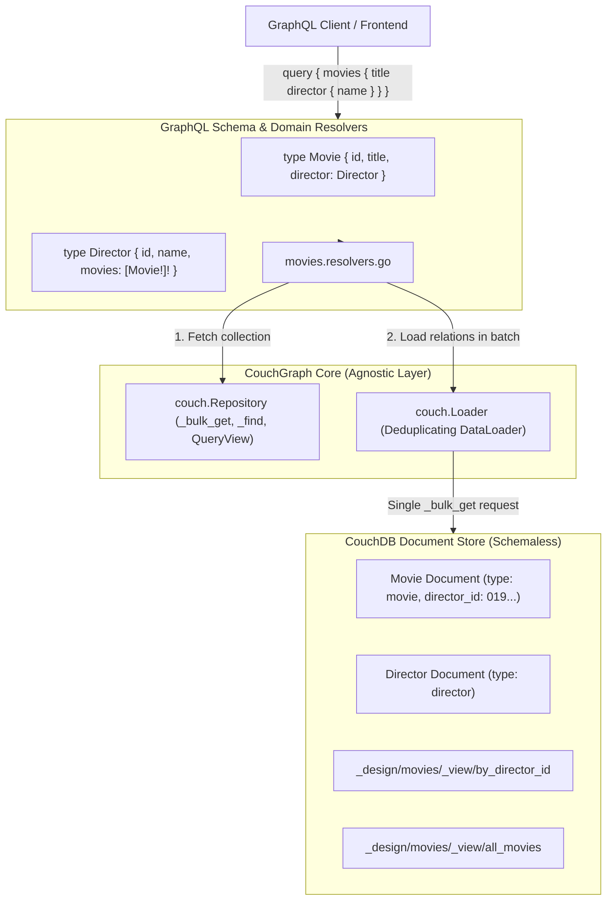

# Relations & Domain Modeling in CouchGraph

This document explains how to cross documents, model 1:1 and 1:N relationships, and transform CouchDB Design Documents / Views into strongly-typed GraphQL collections without sacrificing CouchDB's schemaless flexibility or introducing N+1 performance penalties.

---

## 1. Architectural Model: Schemaless Core + Strongly-Typed Domain Layers

CouchGraph is built on a **two-tier architecture**:



1. **Agnostic Core (`internal/couch/`)**: Operates on raw JSON (`map[string]any`), `_bulk_get`, Mango `_find`, and MapReduce `_design` views. It contains zero business logic or entity knowledge.
2. **Domain Schemas (`internal/graph/schema/*.graphqls`)**: Define strongly-typed entities (`Movie`, `Director`, etc.), relationships, and business queries.
3. **Domain Resolvers (`internal/graph/resolver/*.resolvers.go`)**: Map domain queries to CouchDB views/indexes and resolve nested relations using `couch.Loader`.

---

## 2. Modeling 1:1 Relationships (Foreign Keys + DataLoader)

### CouchDB Document Structure
Each document uses a **UUIDv7** primary key (`_id`) and stores foreign key references as string IDs:

```json
// Director Document
{
  "_id": "01a107be-6492-7538-8ed8-8262766ca648",
  "type": "director",
  "name": "Christopher Nolan",
  "nationality": "British-American"
}

// Movie Document
{
  "_id": "01a107be-6492-7538-8ed8-8262766cb111",
  "type": "movie",
  "title": "Inception",
  "director_id": "01a107be-6492-7538-8ed8-8262766ca648",
  "year": 2010
}
```

### GraphQL Schema Definition
In `internal/graph/schema/movies.graphqls`:

```graphql
type Movie {
  id: ID!
  title: String!
  year: Int!
  directorId: ID
  
  """
  Nested 1:1 relation resolved via DataLoader (_bulk_get batching).
  Zero N+1 database queries!
  """
  director: Director
}
```

### Resolver Implementation (Zero N+1)
In `internal/graph/resolver/movies.resolvers.go`:

```go
func (r *movieResolver) Director(ctx context.Context, obj *model.Movie) (*model.Director, error) {
	if obj.DirectorID == nil || *obj.DirectorID == "" {
		return nil, nil
	}

	// DataLoader batches all director IDs from all movies in the request
	// into a single CouchDB _bulk_get call.
	loader := couch.NewLoader(r.Repo)
	doc, err := loader.LoadAndWait(ctx, *obj.DirectorID)
	if err != nil {
		return nil, err
	}
	return mapToDirector(doc), nil
}
```

---

## 3. Modeling 1:N Relationships (MapReduce Views)

To resolve reverse relationships (e.g. `Director.movies`), use a CouchDB MapReduce View indexed by the foreign key.

### CouchDB Design Document View
In `_design/movies`:

```javascript
{
  "views": {
    "by_director_id": {
      "map": "function (doc) { if (doc.type === 'movie' && doc.director_id) { emit(doc.director_id, doc); } }"
    }
  }
}
```

### GraphQL Schema Definition
```graphql
type Director {
  id: ID!
  name: String!
  nationality: String!
  
  """
  Nested 1:N relation: all movies directed by this person.
  """
  movies: [Movie!]!
}
```

### Resolver Implementation
```go
func (r *directorResolver) Movies(ctx context.Context, obj *model.Director) ([]*model.Movie, error) {
	falseVal := false
	res, err := r.Repo.QueryView(ctx, couch.ViewOptions{
		DesignDoc: "movies",
		ViewName:  "by_director_id",
		Key:       obj.ID,
		Reduce:    &falseVal,
	})
	if err != nil {
		return nil, err
	}

	movies := make([]*model.Movie, 0, len(res.Rows))
	for _, row := range res.Rows {
		if m, ok := row.Value.(map[string]any); ok {
			movies = append(movies, mapToMovie(m))
		}
	}
	return movies, nil
}
```

---

## 4. Querying Relational Data in GraphQL Playground

### 1:1 Nested Director Query
```graphql
query {
  movies(minRating: 8.8, limit: 5) {
    title
    year
    rating
    director {
      name
      nationality
    }
  }
}
```

### 1:N Filmography Query
```graphql
query {
  directors {
    name
    nationality
    movies {
      title
      year
      rating
    }
  }
}
```

---

## 5. Recipe: Adding a New Relational Entity to CouchGraph

1. **Create the Schema File**: Add `internal/graph/schema/<entity>.graphqls`.
2. **Configure Resolver in `gqlgen.yml`**:
   ```yaml
   models:
     YourEntity:
       fields:
         relatedEntity:
           resolver: true
   ```
3. **Generate Resolver Stubs**: Run `$(go env GOPATH)/bin/gqlgen generate`.
4. **Implement Field Resolvers**: Use `couch.NewLoader` for 1:1 lookups and `r.Repo.QueryView` for 1:N collections.
5. **Verify Compilation**: Run `go build ./...` and `go vet ./...`.
