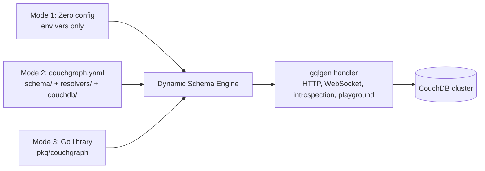
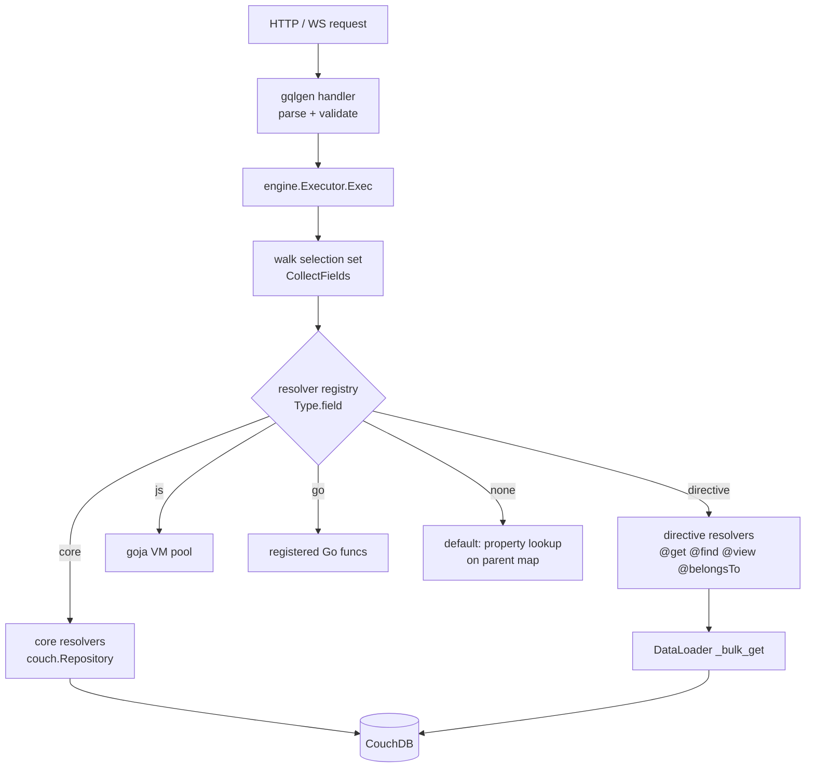

# RFC-001: Dynamic Schema Engine (Standalone, Config-Driven Mode)

| Field   | Value                                   |
|---------|-----------------------------------------|
| Status  | Steps 1–3 complete (engine, directives, typed mutations, CLI watch & index sync); Steps 4–5 next |
| Authors | CouchGraph maintainers                  |
| Created | 2026-10-06                              |

---

## 1. Motivation

Today, adding a typed domain (e.g. `Movie`, `Director`) to CouchGraph requires:

1. Editing `internal/graph/schema/*.graphqls`
2. Running `gqlgen generate`
3. Writing Go resolvers
4. Recompiling and redeploying the binary

That is fine for Go teams, but it excludes the main audience of CouchGraph: teams that **already have CouchDB clusters full of documents** (often produced by cascading pipelines, sync jobs, mobile replicas) and simply want a GraphQL layer on top — **without writing or compiling Go**.

The goal of this RFC is to make CouchGraph a **standalone product**: download a binary (or Docker image), point it at a CouchDB cluster and, optionally, at a folder containing schema definitions and resolvers.

## 2. Usage Modes (one engine, three entry points)



| Mode | Who | What they provide | What they get |
|------|-----|-------------------|---------------|
| 1. Zero config | Anyone | `COUCHDB_URL`, credentials | Generic API: `document`, `documents`, `findDocs`, `queryView`, `databases`, `serverInfo`, mutations, `docChanges` |
| 2. Config + folder | Non-Go teams | `couchgraph.yaml`, SDL with directives, optional JS resolvers, design docs | Typed domain API, relations, views, custom logic |
| 3. Go library | Go teams | Native Go resolvers registered on the engine | Everything above + compiled, type-checked custom logic |

Mode 1 already works today. Modes 2 and 3 are introduced by this RFC.

## 3. Project Layout (Mode 2)

```text
my-api/
├── couchgraph.yaml
├── schema/
│   ├── movies.graphqls
│   └── directors.graphqls
├── resolvers/
│   └── movies.js
└── couchdb/
    └── design/
        └── movies.json
```

### 3.1 `couchgraph.yaml`

```yaml
couchdb:
  url: ${COUCHDB_URL}
  user: ${COUCHDB_USER}
  password: ${COUCHDB_PASSWORD}
  database: movies            # default database (optional, see multi-db roadmap)

schema:
  core: true                  # expose the generic core API (document, findDocs, ...)
  paths:
    - ./schema/**/*.graphqls

resolvers:
  paths:
    - ./resolvers/**/*.js
  timeout: 2s                 # per-call JS execution budget

designDocs:
  paths:
    - ./couchdb/design/*.json
  sync: on-start              # never | on-start | manual (via `couchgraph sync`)

server:
  port: 8080
  playground: true
  readOnly: false

auth:
  enabled: true
  jwtSecret: ${JWT_SECRET}
  requireAuth: false
```

Every key keeps its current environment variable fallback, so Mode 1 (env only) remains valid.

## 4. Directive Specification

The user SDL is merged with the embedded **core SDL** at boot. Directives describe how each field maps to CouchDB, so the engine can resolve it without code.

| Directive | Location | Meaning |
|-----------|----------|---------|
| `@collection(type: String!, field: String = "type")` | `OBJECT` | Documents of this type are those where `doc[field] == type` |
| `@field(from: String!)` | `FIELD_DEFINITION` | Read value from a different document key (`directorId` ← `director_id`). `id` maps to `_id` by default |
| `@get` | `FIELD_DEFINITION` (Query) | Fetch one document by the `id` argument via DataLoader (`_bulk_get`) |
| `@find(selector: String!, sort: String, limit: Int)` | `FIELD_DEFINITION` | Mango `_find`. `$arg` placeholders are replaced by field arguments |
| `@view(name: String!, key: String, reduce: Boolean, group: Boolean, includeDocs: Boolean = true)` | `FIELD_DEFINITION` | Query `_design/{ddoc}/_view/{view}` |
| `@belongsTo(field: String!)` | `FIELD_DEFINITION` | 1:1 relation: load the document whose `_id` is `parent[field]` (batched) |
| `@hasMany(view: String!, key: String = "$parent.id")` | `FIELD_DEFINITION` | 1:N relation via a view keyed by the parent id |
| `@js(fn: String!)` | `FIELD_DEFINITION` | Delegate to a JS resolver (`resolvers/*.js`) |
| `@owner(field: String!)` | `OBJECT` | Row-level security: only return/write documents where `doc[field] == jwt.sub` (future) |

### 4.1 Example: the movies domain without Go

```graphql
type Movie @collection(type: "movie") {
  id: ID!
  title: String!
  year: Int!
  rating: Float!
  genres: [String!]!
  boxOfficeUsd: Int @field(from: "box_office_usd")
  directorId: ID    @field(from: "director_id")
  director: Director @belongsTo(field: "director_id")
  ratingLabel: String! @js(fn: "movies.ratingLabel")
}

type Director @collection(type: "director") {
  id: ID!
  name: String!
  birthYear: Int! @field(from: "birth_year")
  movies: [Movie!]! @hasMany(view: "movies/by_director_id")
}

type GenreCount {
  genre: String! @field(from: "key")
  count: Int!    @field(from: "value")
}

extend type Query {
  movie(id: ID!): Movie @get
  topMovies(minRating: Float = 8.5, limit: Int = 10): [Movie!]!
    @find(selector: "{\"type\":\"movie\",\"rating\":{\"$gte\":\"$minRating\"}}",
          sort: "[{\"rating\":\"desc\"}]", limit: 10)
  moviesByGenre(genre: String!): [Movie!]! @view(name: "movies/by_genre", key: "$genre")
  genreCounts: [GenreCount!]! @view(name: "movies/by_genre", reduce: true, group: true)
}
```

### 4.2 JS resolvers (goja)

```js
// resolvers/movies.js
export function ratingLabel(parent, args, ctx) {
  if (parent.rating >= 9) return "masterpiece";
  if (parent.rating >= 8) return "great";
  return "good";
}

export async function similar(parent, args, ctx) {
  // ctx.couch exposes read helpers bound to the request (auth + DataLoader)
  return ctx.couch.find({ type: "movie", genres: { $in: parent.genres } }, { limit: 5 });
}
```

- Runs in [goja](https://github.com/dop251/goja) (pure Go, no cgo), one VM pool per process.
- `ctx` exposes: `user` (JWT claims), `couch.get/getMany/find/view`, `log`.
- Hard execution timeout (`resolvers.timeout`) and no filesystem/network access.

### 4.3 Go library (Mode 3)

```go
eng, _ := couchgraph.New(couchgraph.Options{ConfigFile: "couchgraph.yaml"})
eng.Resolve("Movie.similar", func(ctx context.Context, p couchgraph.Params) (any, error) {
    return p.Couch.Find(ctx, couch.FindOptions{ /* ... */ })
})
http.ListenAndServe(":8080", eng.Handler())
```

## 5. Architecture

### 5.1 Key decision: a dynamic `graphql.ExecutableSchema`

We do **not** run a second GraphQL engine. Instead, we implement gqlgen's `graphql.ExecutableSchema` interface dynamically on top of `gqlparser`'s `*ast.Schema`:

```go
type ExecutableSchema interface {
    Schema() *ast.Schema
    Complexity(ctx context.Context, typeName, fieldName string, childComplexity int, args map[string]any) (int, bool)
    Exec(ctx context.Context) ResponseHandler
}
```

The dynamic schema is plugged into the **existing** `handler.NewDefaultServer`, which preserves:

- HTTP POST/GET/multipart and WebSocket transports (subscriptions)
- Parsing, validation, query caching, APQ
- Introspection and the GraphiQL playground
- `AroundOperations` mutation guard, JWT middleware, Prometheus metrics



### 5.2 Executor responsibilities

1. Pick the root type by operation (`query` / `mutation` / `subscription`).
2. Walk the selection set with `graphql.CollectFields` (fragments, `@skip`, `@include`).
3. Coerce field arguments using the operation variables (`ast.Value.Value(vars)`), applying SDL defaults.
4. Resolve each field via the registry; fall back to a **default resolver** that reads `parent[field]` (maps or structs).
5. Complete values according to the field type: non-null checks with null propagation, lists, scalars (`Map` passthrough), enums, objects, interfaces/unions via `__typename`.
6. Serve `__typename`, `__schema` and `__type` via gqlgen's `introspection` package.
7. Subscriptions: the resolver returns a channel; each event is completed against the selection set and emitted as one response.

### 5.3 Packages

| Package | Role |
|---------|------|
| `internal/engine` | Dynamic executor, resolver registry, core resolvers |
| `internal/engine/directives` | Directive → resolver compilation (Step 2) |
| `internal/engine/jsruntime` | goja VM pool and `ctx` bindings (Step 4) |
| `internal/couch` | Unchanged: Repository + DataLoader |
| `internal/auth`, `internal/config` | Unchanged; config gains `schema`, `resolvers`, `designDocs` |
| `pkg/couchgraph` | Public Go API (Step 5) |
| `examples/movies` | Movies domain rewritten as SDL + directives |

## 6. CLI

| Command | Purpose |
|---------|---------|
| `couchgraph init` | Scaffold `couchgraph.yaml`, `schema/`, `resolvers/`, `couchdb/design/` |
| `couchgraph serve` | Start the server (`--watch` hot-reloads schema and JS in dev) |
| `couchgraph validate` | Check SDL + directives, referenced views exist, Mango indexes cover `@find` selectors/sorts, JS exports exist |
| `couchgraph sync` | Push design docs and Mango indexes to CouchDB (idempotent, compares `_rev`/content) |

Distribution: goreleaser binaries, Homebrew tap, Docker image `ghcr.io/devton/couchgraph`.

## 7. Delivery Plan

| Step | Scope | Exit criteria |
|------|-------|---------------|
| 1. Prototype | `internal/engine` serving the current core schema; `ENGINE=dynamic` switch in `cmd/server` | Parity tests: identical queries return identical JSON on both engines (incl. introspection, errors, subscriptions). If parity fails, stop cheaply |
| 2. Directives | `couchgraph.yaml`, directive compiler (`@field`, `@get`, `@find`, `@view`, `@belongsTo`, `@hasMany`, `@create`, `@update`, `@delete`), `examples/movies` migrated | Movies example served with zero Go code, typed queries & mutations supported |
| 3. CLI | `init`, `serve --watch`, `validate`, `sync` (design docs & Mango indexes) | End-to-end quickstart without Go toolchain, live hot reload in dev |
| 4. JS/TS resolvers | Sandbox runtime with timeouts and `ctx.couch` | `@js` fields work, sandbox tests pass |
| 5. Go library | `pkg/couchgraph` public API | Movies example re-implemented with native Go resolvers on the same engine |

**Progress:**
- Step 1 complete: Parity suite in `internal/engine` passing (~13% overhead vs generated code).
- Step 2 complete: Directive compiler with read and write directives (`@create`, `@update`, `@delete`), batch loader, and `examples/movies` schema.
- Step 3 complete: Standalone CLI with `init`, `serve --watch` (fsnotify hot reload), `validate`, and `sync` (both MapReduce design docs and Mango indexes).
- Step 4 complete: TypeScript and JavaScript custom resolver runtime via embedded esbuild + Goja (`@resolver`, `@ts`, `@js`), zero Node.js dependency, sandboxed with timeouts and `ctx.couch`.
- Step 5: Next up. Apollo Federation is out of scope for the dynamic engine.

## 8. Trade-offs and Risks

| Topic | Impact | Mitigation |
|-------|--------|------------|
| Loss of compile-time type safety | Resolver mistakes surface at runtime | `couchgraph validate`, strict result completion with clear error paths, Go library mode for teams that want types |
| Performance (reflection/maps vs generated code) | Slightly slower field resolution | Document I/O dominates; DataLoader batching unchanged; benchmark in Step 1 |
| Spec compliance of a hand-written executor | Edge cases (null propagation, fragments on unions) | Reuse gqlgen `CollectFields`, gqlparser validation, introspection; parity tests |
| JS sandbox escape / runaway scripts | Availability and security | goja has no I/O by default; per-call timeout via `vm.Interrupt`; only curated `ctx` bindings |
| Mango selectors without indexes | Slow full scans | `validate` warns; `sync` can create indexes declared in `couchdb/` |

## 9. Open Questions

1. Should `@find` selectors be written as JSON strings (current proposal) or as a GraphQL input literal (`selector: {type: "movie"}`)? Literals are nicer but require a `Map`-typed directive argument.
2. Should field names default to camelCase → snake_case mapping (avoiding most `@field(from:)` usages), configurable in `couchgraph.yaml`?
3. Generated typed mutations (`createMovie`, `updateMovie`) from `@collection`, or keep only generic `upsertDoc` until RLS (`@owner`) lands?
